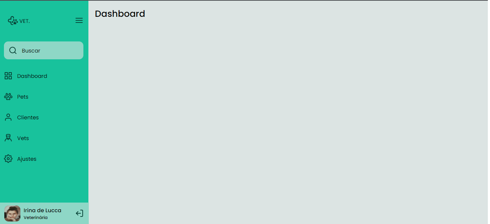

<h1 align="center">
  
</h1>

  <a href="#-tecnologias">Tecnologias</a>&nbsp;&nbsp;&nbsp;|&nbsp;&nbsp;&nbsp;
  <a href="#-projeto">Projeto</a>&nbsp;&nbsp;&nbsp;|&nbsp;&nbsp;&nbsp;

 

  

## 🚀 Tecnologias

Tecnologias usadas para esse projeto:

- HTML
- CSS
- JavaScript

## 💻 Projeto

O projeto é uma página com uma sidebar(barra lateral) responsiva que mostra algumas informações juntamente com ícones, que pode
ser aberta, mostrando todas as informações, e fechada mostrando somente os ícones.